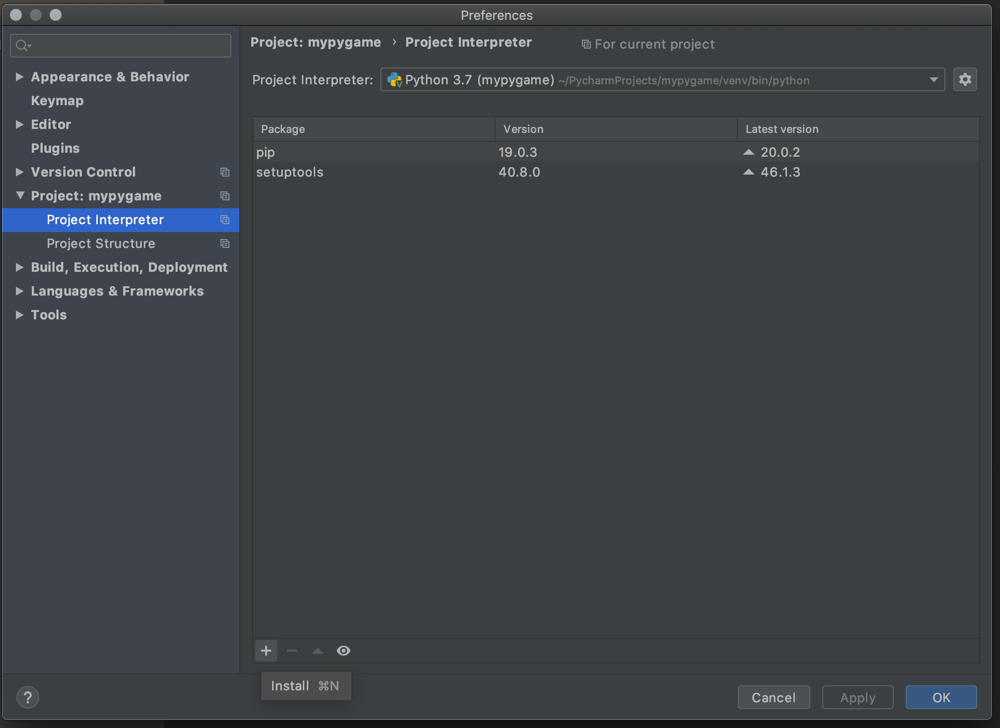
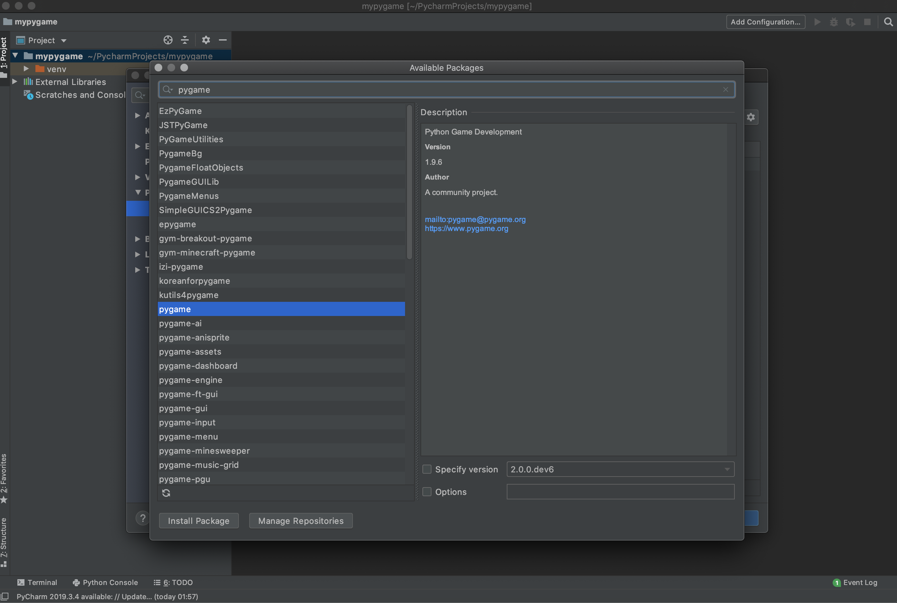

## pygame
Mit [`pygame`](https://www.pygame.org) steht euch eine Python Bibliothek zur Verfügung um grafische Spiele mit Python zu entwickeln. Mit pygame werden euch die nötigen Basics abgenommen die man für die Entwicklung von Spielen benötigt. Das ganze ist jedoch nicht geschenkt, ich erwarte nicht das ihr mit euren aktuellen Wissensstand selbständig Spiele entwicklen könnt. Meine Idee ist wir fangen mit einem Tutorial an welches ihr selbständig oder in 2er Gruppen durcharbeiten sollt.
Copy/Paste oder besser abschreiben der Lösugen ist hierbei erwünscht, vergesst aber nicht die Kommentare **genau** zu lesen und versucht sie zu verstehen. Sobald ihr etwas Lauffähiges habt, einfach mal Sachen ausprobieren oder das Spiel weiter entwickeln.    

### Vorbereitung
#### Kommunikation
Wir benötigen nicht nur in Zeiten COVID-19 Möglichkeiten uns über das Internet auszutauschen und uns virtuell zu treffen. 
Folgende Lösungen würde ich vorschlagen:
* **Github** hier werden wir den Sourcecode teilen um gemeinsam zu entwicklen. Teams teilen sich ein Repository um gemeinsam an einem Spiel zu entwickeln. Ich kann eueren Code reviewen und mit Hilfen und Kommentaren euch zur Seite stehen. Weiterhin werde ich diese Übungsseiten pfegen und erweitern.
* **WhatsApp** für Windows/Mac installieren und aktivieren, darüber können wir uns einfach über Chats benachrichtigen und austauchen
* **Discord** möchte ich dazu nutzen uns virtuell zu treffen und gemeinsam am Code zu arbeiten. Falls ihr noch keinen Account habt richtet euch bitte ein [Discord Account](https://discordapp.com) ein, installiert die App auf euren Rechner und testet euere Hardware (Headset, Cam,...). Hier kommit ihr auf unseren Team Server: [Brickcentric Server](https://discord.gg/QgvtWYc) 
* **EMail** ist vielleicht nicht das wichtigste Medium aber hierüber erhaltet ihr Updates die bei Github entstehen.
#### pygame
Ihr benötigt eine vollstänig eingerichtete Entwicklungsumgebung für Python [(wie auf der Hauptseite beschrieben)](README.md) .
In PyCharm müsst ihr die Bibliothek `pygame` wie folgt hinzufügen. 

### Aufgaben
#### 1. Aufbau
Versucht eine lauffähige Python Entwicklungsumgebung an den Start zu bringen, falls ihr dabei Probleme habt fragt jemanden aus der Gruppe oder mich per WhatsApp direkt Nachricht. Wir können dann bespielsweise ein Discord Meeting Termin vereinbaren.
#### 2. Infos  
* Lest euch bitte mal folgendes [Pygame Tutorial](https://www.spieleprogrammierer.de/wiki/Pygame-Tutorial) genau durch und versucht die Beispiele bei euch ans laufen zu bekommen. 
* Für ine erste Einführung ist das hier auch sehr interessant [Grundlage pygame](https://www.python-lernen.de/pygame-tutorial.htm) 
* Das ist die offizelle Seite von [`pygame`](https://www.pygame.org). 
* Für die youtube Fraktion gibt es auch ein umfangreiches YouTube Tutorial aber auf Englisch [YouTube Tutorial](https://www.youtube.com/watch?v=i6xMBig-pP4)
* Ein super Buch für euch gibt es hier in Englisch frei zugänglich [Create Computer Games](https://inventwithpython.com/invent4thed/) und auf Deutsch bei Amazon [Eigene Spiele programmieren](https://www.amazon.de/Eigene-Spiele-programmieren-spielerische-Programmiersprache/dp/3864904927)
#### 3. Lösung
* Wir haben eine Lösung für die erste Spielenginee aus dem Tutorial hier hochgeladen: https://github.com/rednael05/runandjump
* Ihr könnt das Pojekt einfach **forken** das heißt eine Kopie hiervon auf euerem Git Account anlegen. Dafür müsst ihr nur auf dem Repository oben rechts auf den Button `Fork` klicken und euren Account auswählen.
* Dannach könnt ihr das Projekt aus eurem Github Repository nach Pycharm runterladen. Dafür müsst ihr in **eurem** Repository sein und auf den grünen Button `clone or download` klicken, diese URL kopieren und in Pycharm auf den Menüpunkt: VCS -> Get from Version Control... gehen. Die URL in das Feld `URL` einfügen und dann auf den Button `Clone` drücken.
* Dannach solltet ihr das Projekt geöffent haben, was jetzt noch fehlt ist wie oben beschrieben die Bibliothek zu aktivieren.  
* Nun könnt ihr rechte Maus auf die Datei `Launcher.py` `Run Launcher` ausführen und ihr solltet eine erste Zufallsmap sehen.

